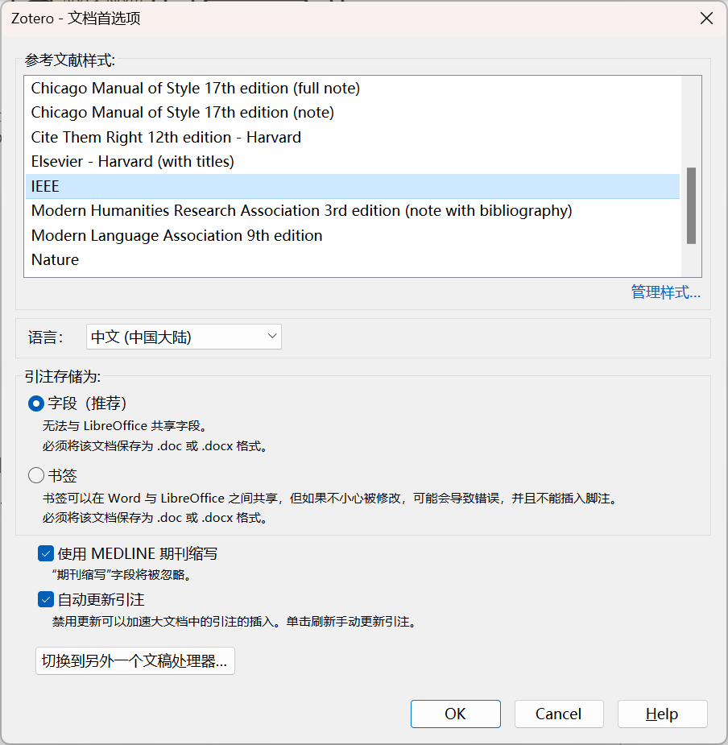

# 写作规范

## 总体要求

1. 语言应简练易懂，避免口语、歧义、超长句。
2. 避免侵犯著作权
3. 可以使用ChatGPT生成内容，但是需要经过润色

## 基本信息

使用word编写文档，格式保存为`.docx`。

- 页面布局：页边距上4.5cm，下3.1cm，左3.1cm，右3.1cm
- 纸张大小：A4
- 在页脚居中位置插入页码

**为了尽量减少诸位在排版上的工作量，已经在模板文档的样式库中提前设置好了标题与正文的样式。所以请直接使用模板文档进行编写。**

**请只使用样式库里已有的样式，不要修改样式，也不要添加样式。**

## 行文

- 正文：宋体、五号
- 标题：黑体
  - 一级标题：三号
  - 二级标题：四号
  - 三级标题：小四
- 正文行间距：1.5倍
- 西文：等线，默认

**要求**：

- 不要引入四级标题，有必要的话使用编号列表代替

## 公式

通过组合键`Alt`+`=`可以快速插入公式。或者，可通过word工具栏的`插入->符号->公式`插入公式。

公式格式选择UnicodeMath或LaTeX均可。

**要求**：

- 公式居中
- 只为重要的公式或者需要在正文中引用的公式进行编号
- 每个章节的公式编号从1开始连续编号，不要重复和间断

## 图片

位置：自由安排，居中为主

题注：`图 [chapter_number]-[image_number]  [description]`

题注样式：黑体、五号

> 例如：`图 1-1  描述`

**注意**，在`图`和`1-1`之间有1个空格，在`1-1`和`描述`中间有2个空格。

**要求**：

- 先见文，后见图。即图片应该插入在文字下方。
- 引用的图中如有英文，需要翻译为中文
- 自己绘制的图**仅使用**配色方案中的颜色，格式应为`.svg`
- 屏幕截图只要清晰即可

## 表格

样式：默认样式

题注：`表 [chapter_number]-[table_number]  [description]`

> 例如：`表 1-1  描述`

**注意**：在`表`和`1-1`之间有1个空格，但在`1-1`和`描述`中间有2个空格。

图注样式：黑体、五号

**要求**：

- 先见文后见表。即表格应该插入在文字下方。
- 在一页写不下需转页时，要重复书写表头并在上表线右上方写“（续）”字。
- 表格按章连续编号，不要断号或重号。

## 代码

**要求**：

- 源代码以`.py`格式保存
- 第8章以前的代码，使用 numpy 实现
- 第8章的代码按小节决定使用的框架
- 第8章以后的代码，使用 PyTorch 和 MindSpore 两个框架分别实现

### 代码规范

- 命名规范

  - 函数：`def this_is_function():`

  - 变量：`var_name`

  - 类名：`class ThisIsClass():`


- 注释
  - 不用写文档注释
  - 应按个人习惯为必要的部分加入单行注释（中文）

其他部分参考[PEP 8](https://blog.csdn.net/ratsniper/article/details/78954852)。

## 引用

**要求**：

- 使用zotero的word扩展插入引用

- 引用文字时，插入引用到句末
- 引用图片时，插入引用到题注末尾
- 引用格式为IEEE

## 术语

**要求**：

- 文章中使用的术语应与[此项目](https://github.com/dair-ai/ml-visuals)提供的术语表保持一致

## 提交

提交到GitHub仓库：`NPU-IIL/DeepLearningBookWriting`

仓库目录结构：

```
/
|- Chapter_1
    |- img
    |- src
    |- [chapter_number]-[chapter_name].docx
|- Chapter_2
  	|- ...
```

- 在`img`目录下存放图片
- 在`src`目录下存放源代码

## 部分word操作指南

### 绘制图片并插入文档

1. 使用PowerPoint绘图。

2. 绘制完成后，选中图形的所有部分

3. 复制

4. 在PowerPoint的工具栏中，找到**选择性粘贴**，如下图。

   

5. 选择**粘贴**，作为**图片（增强型图元文件）**

   

6. 将粘贴后的结果重新复制，再粘贴到word文档中

这样得到的图片不会因缩放而失真。

也可以使用其他软件绘制，只要满足格式为`.svg`即可。

### 修改标题号


### 公式编号

为公式编号的方法：

```text
[equation] #([chapter_number]-[equation_number])
```

- `equation`为公式
- `chapter_number`为章节号
- `equation_number`为章节中的公式编号

例如：

```text
f(x)=ax^2+bx+c #(1-1)
```

渲染如下：

$$
f(x)=ax^2+bx+c \tag{1-1}
$$

**注意**：不要使用`\tag{}`，word里的公式不支持这个语法。

### 插入代码

从IDE中复制代码。粘贴代码到word时，右键选择仅保留文本，这样会去掉在IDE中的代码样式。


然后，选中所有代码，在样式库中选择“code”样式。 

### 插入题注的方法

建议先在word顶部搜索栏中搜索“插入题注”，然后将其加入快速访问工具栏。


对于图片，可以直接在右键菜单中选择**插入题注**。

对于表格，请使用快速访问工具栏，手动选择标签“表”。

插入的题注序号应当是自动分配的。如果没有自动分配，请在插入题注时，检查“**编号**”中的设置是否与下图一致：


### 插入引用与参考文献

使用Zotero插入引用与参考文献。

下载Zotero后，应该会自动在Word加入扩展。


如上图所示，我们主要使用Add/Edit Citation和Add/Edit Bibliography两个功能。

先设置Document Preferences，将参考文献样式设置为IEEE：



在需要插入引用的地方，选择Add/Edit Citation，会唤出Zotero搜索栏，在里面搜索并选中你要插入的文献即可。


在需要插入参考文献的地方，选择Add/Edit Bibliography，点一下即可。


## 其他信息

### 分工

范瑞龙：1-深度学习历史，2-人工神经网络

王纪元：3-卷积神经网络，4-卷积网络的进化

刘源：5-循环神经网络，6-自编码器

苏萌：7-搭建自己的深度学习框架

张志伟：8-深度学习系统，9-如何构建应用

王璇：10-优化算法分析

吴波：11-调参策略

覃一航：12-迁移学习

伊浩源：13-生成对抗网络

张江源：14-深度学习真的是黑盒么

张译：15-图神经网络

王旭：16-从注意力机制到BERT

### 供参考的资源

#### 课程

- [CMSC5711 Image Processing and Computer Vision](http://www.cse.cuhk.edu.hk/~khwong/www2/cmsc5711/cmsc5711.html)
- [CS230 Deep Learning](https://cs230.stanford.edu/)
  - [CS230 PyTorch Code Examples](https://cs230.stanford.edu/blog/pytorch/)
  - [CS230 Project](https://cs230.stanford.edu/project/)
- [CSC 321 Intro to Neural Networks and Machine Learning](https://www.cs.toronto.edu/~rgrosse/courses/csc321_2018/)
- [CMU-10707 - Deep Learning](https://deeplearning-cmu-10707-2022spring.github.io/)

#### 其他

- [Blog - Calculus on Computational Graphs: Backpropagation](https://colah.github.io/posts/2015-08-Backprop/) 计算图、反向传播
- [YouTube - 李宏毅 Computational Graph & Backpropagation](https://www.youtube.com/watch?v=-yhm3WdGFok) 计算图、反向传播
- （已失效）[Machine learning models on a remote Hadoop cluster](https://www.ibm.com/docs/en/dselcv?topic=data-machine-learning-models-hadoop)
- [GitHub - HuaizhengZhang/Awesome-System-for-Machine-Learning](https://github.com/HuaizhengZhang/Awesome-System-for-Machine-Learning)：一些机器学习系统相关研究的精选，以及论文笔记
- [Blog - CSE 599W 课程笔记](https://jcf94.com/2018/10/04/2018-10-04-cse559w/)
- [Blog - Deep Learning on Hadoop 2.0](https://medium.com/paypal-tech/deep-learning-on-hadoop-2-0-16b4db3c65dc)
- [Blog - 一文读懂Depthwise卷积](https://blog.csdn.net/weixin_44106928/article/details/103079668)
- [Blog - Evolution of Graph Computation and Machine Learning](https://towardsdatascience.com/evolution-of-graph-computation-and-machine-learning-3211e8682c83) 
- [Deep Learning From Scratch: Theory and Implementation](https://www.codingame.com/playgrounds/9487/deep-learning-from-scratch---theory-and-implementation/computational-graphs)
- [Deep Learning From Scratch I: Computational Graphs](https://www.sabinasz.net/deep-learning-from-scratch-i-computational-graphs/) 计算图
- [Computational Graphs](https://www.tutorialspoint.com/python_deep_learning/python_deep_learning_computational_graphs.htm) 计算图
- [Dynamic vs Static Computational Graphs – PyTorch and TensorFlow](https://www.geeksforgeeks.org/dynamic-vs-static-computational-graphs-pytorch-and-tensorflow/?ref=rp) 动态、静态计算图
- [Blog - On chain rule, computational graphs, and backpropagation](http://outlace.com/on-chain-rule-computational-graphs-and-backpropagation.html) 链式法则、计算图、反向传播
- [Computational Graphs in Deep Learning](https://www.geeksforgeeks.org/computational-graphs-in-deep-learning/) 计算图
- [StackExchange - What is a Dynamic Computational Graph?](https://ai.stackexchange.com/questions/3801/what-is-a-dynamic-computational-graph) 动态计算图
- [GitHub - v-iashin/CS231n](https://github.com/v-iashin/CS231n) PyTorch/Tensorflow solutions for Stanford's CS231n: "CNNs for Visual Recognition"
- [Blog - Hyperparameter Tuning in Python: a Complete Guide](https://neptune.ai/blog/hyperparameter-tuning-in-python-complete-guide) 调参指南
- [Blog - Understanding Graph Convolutional Networks for Node Classification](https://towardsdatascience.com/understanding-graph-convolutional-networks-for-node-classification-a2bfdb7aba7b) 图卷积网络
- [Blog - Graph Convolutional Networks](https://tkipf.github.io/graph-convolutional-networks/) 图卷积网络
- [Blog - 深度学习发展史](https://blog.csdn.net/fendouaini/article/details/79788106)
- [OPEN MLSYS 机器学习系统：设计和实现](https://openmlsys.github.io/index.html) 开源书籍
